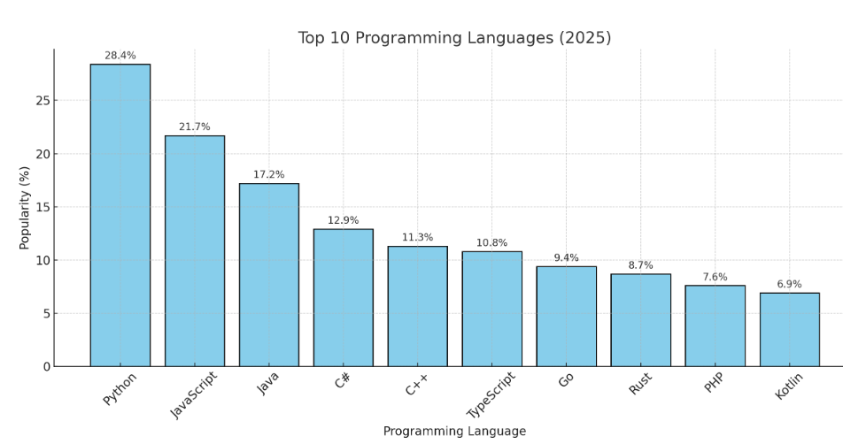
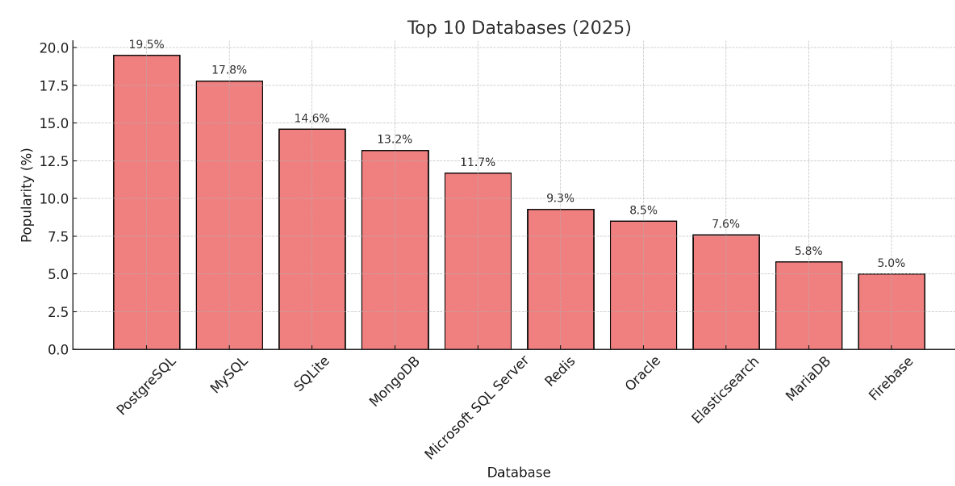
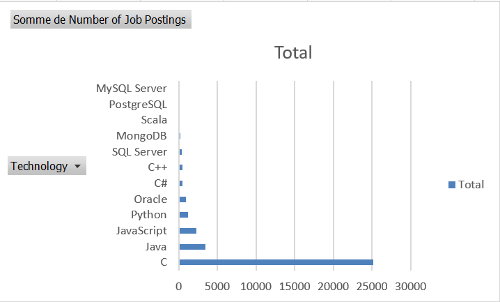
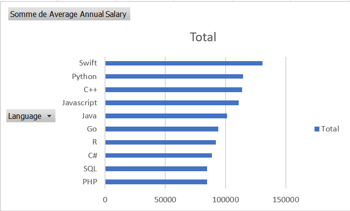
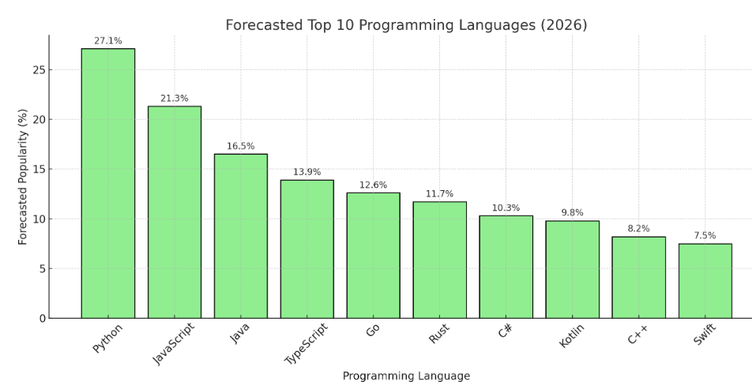
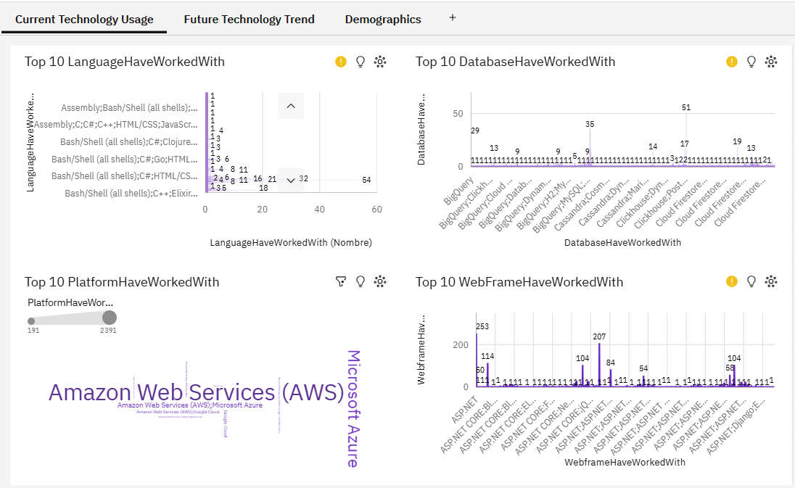
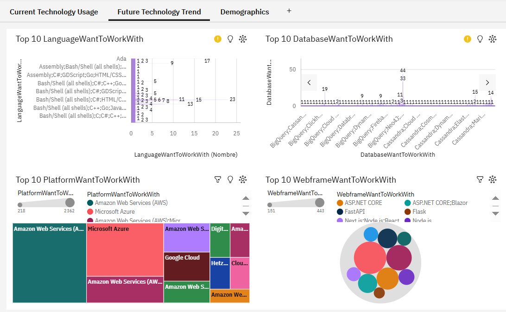
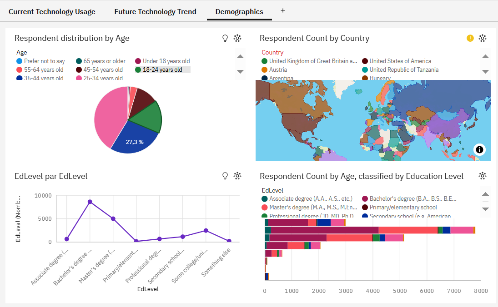

# IBM Data Analyst Professional Certificate — Capstone Project

Final project for the [IBM Data Analyst Professional Certificate](https://www.coursera.org/professional-certificates/ibm-data-analyst) on Coursera. The project covers the full data analysis pipeline: collection, wrangling, exploratory analysis, visualization, and dashboard reporting.

---

## Overview

The central dataset is the **Stack Overflow Developer Survey** (65 437 respondents, 114 columns, 185 countries). Supplementary datasets cover job postings, programming language salaries, car sales, fleet inventories, and startup funding.

The work is organized across six modules, each building on the previous one.

---

## Project Structure

```
.
├── notebooks/          # Jupyter notebooks (Python)
├── assets/             # Dashboard screenshots (Cognos)
├── data/               # Local datasets, not tracked (see Data section below)
├── presentation/       # PDF file summarizing the overall hands-on-lab results
└── LICENSE
```

---

## Modules

### Module 1: Data Collection

| Notebook | Description |
|---|---|
| `Web-Scraping-Lab.ipynb` | Scrapes programming language salaries from an HTML table using BeautifulSoup, exports to CSV |
| `Collecting_job_data_using_APIs-Lab.ipynb` | Queries a Jobs API (Flask/JSON) to count postings by technology and location, exports to Excel |

**Key outputs:** `popular-languages.csv`, `job-postings.xlsx`, `job-postings-2.xlsx`

---

### Module 2: Data Wrangling

| Notebook | Description |
|---|---|
| `Hands-on Lab Finding Duplicates_v2.ipynb` | Detects and removes duplicate rows |
| `Hands-on Lab 8 Finding Missing Values.ipynb` | Identifies missing values per column |
| `Hands-on Lab 9 Imput Missing Values.ipynb` | Fills missing values with mode/mean strategies |
| `Hands-on Lab 10 Normalizing Data.ipynb` | Normalizes compensation columns |

---

### Module 3: Exploratory Data Analysis

| Notebook | Description |
|---|---|
| `M1ExploreDataSet-lab_V2.ipynb` | Dataset overview: shape, dtypes, mean age (32.58 yrs), country count (185) |
| `Hands-on Lab Exploratory Data Analysis.ipynb` | Employment type, job satisfaction vs experience, remote work distribution, language trends by country |
| `Lab 11 Finding How The Data is Distributed.ipynb` | Distribution analysis |
| `Lab 12 Finding Outliers.ipynb` | Outlier detection |
| `Lab 13 Finding Correlation.ipynb` | Correlation matrix between numerical features |

**Selected findings:**
- Median age: ~32.6 years across 185 countries
- Most respondents: full-time employed, working hybrid or remotely
- Job satisfaction peaks in the 10–20 years of experience bracket
- Python, JavaScript, and SQL consistently top the skills charts

---

### Module 4: Data Visualization (Python)

| Notebook | Description |
|---|---|
| `Lab Data Visualization.ipynb` | Bar charts, scatter plots, count plots, heatmaps using Matplotlib & Seaborn |

Covers: language popularity, compensation distributions, remote work preferences, education vs employment type.

| | |
|---|---|
|  |  |
|  |  |
|  | |

---

### Module 5: Excel Analytics

Hands-on labs using Microsoft Excel:

| Dataset | Skills practiced |
|---|---|
| Montgomery Fleet Equipment Inventory | Data cleaning, pivot tables (Parts 1 & 2) |
| Car Sales (Kaggle) | Charts: line, bar, scatter, bubble |
| Customer Demographics & Sales | Advanced pivot tables and slicers |
| Indian Startup Funding | Timeline slicers, multi-sheet dashboards |
| GitHub Job Postings | Pivot-based technology demand analysis |

---

### Module 6: Cognos Analytics Dashboards

Interactive dashboards built in IBM Cognos Analytics (v11+). The final capstone dashboard covers three tabs: current technology usage, future trends, and developer demographics.

**Current Technology Usage**



**Future Technology Trend**



**Demographics**



---

## Stack

| Layer | Tools |
|---|---|
| Language | Python 3.x |
| Data manipulation | pandas, openpyxl |
| Visualization | Matplotlib, Seaborn |
| Collection | requests, BeautifulSoup |
| Notebooks | Jupyter / JupyterLite |
| Excel analytics | Microsoft Excel |
| BI / Dashboard | IBM Cognos Analytics |

---

## Data

The `data/` folder is **not included** in this repository (too large for git).

### Download

All datasets are available as a single archive attached to the [latest GitHub Release](../../releases/latest).

### Datasets at a glance

| File | Source | Size |
|---|---|---|
| `Automotive_Industry.zip` | IBM Skills Network | ~16 MB |
| `Car_Sales_Kaggle_*.xlsx` | Kaggle (Public Domain) | ~130 KB each |
| `Montgomery_Fleet_*.xlsx/.csv` | Montgomery County Open Data | ~12–24 KB each |
| `indian_startup_funding_Lab7*.xlsx` | IBM Skills Network | ~48 KB |
| `Customer_demographics_and_sales_Lab6.xlsx` | IBM Skills Network | ~76 KB |
| `github-job-postings.xlsx` | IBM Skills Network | ~8 KB |
| `popular-languages.csv` | Generated by `Web-Scraping-Lab.ipynb` | ~1 KB |

> **Note:** The core Stack Overflow survey dataset used in the Python notebooks is fetched at runtime directly from IBM's S3 bucket — no local file needed.

---

## How to Run

### Python notebooks

```bash
git clone https://github.com/Boypop/IBM_Data-Analysis_Final_Project.git
cd IBM_Data-Analysis_Final_Project

pip install pandas matplotlib seaborn requests beautifulsoup4 openpyxl

jupyter notebook notebooks/
```

Download the data archive from the [Releases page](../../releases/latest) and extract it into a `data/` folder at the root if you need the Excel lab files locally.

### Excel labs

Open the relevant `.xlsx` files from the data archive in Microsoft Excel (2016 or later recommended).

---

## License

Distributed under the [Apache License 2.0](LICENSE).

Notebooks and lab instructions are based on materials from [IBM Skills Network](https://skills.network) / Coursera. Original datasets retain their respective licenses (see each dataset's source above).
